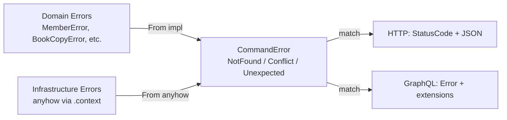

# Error Handling Analysis: `CommandError` vs Domain Errors

## Current Architecture



Your `CommandError` is a **three-variant lossy funnel**:

| Domain Error | Mapped To | What's Lost |
|---|---|---|
| `MemberError::NotFound` | `NotFound { entity: "Member" }` | Nothing — good fit |
| `MemberError::CannotBeSuspended` | `Conflict { message: "..." }` | The variant identity |
| `MemberError::LoanLimitReached` | `Conflict { message: "..." }` | The variant identity |
| `BookCopyError::CannotBeBorrowed` | `Conflict { message: "..." }` | The variant identity |
| `LoanError::CannotBeReturned` | `Conflict { message: "..." }` | The variant identity |

Every business rule violation becomes an opaque `Conflict { message: String }`. The domain error's variant — the only thing that lets a caller react programmatically — is erased.

## The Core Problem

### 1. You're classifying errors too early

`CommandError` forces a decision about HTTP semantics (`NotFound`, `Conflict`) **inside the application layer**, which shouldn't know about HTTP. The application layer's job is to orchestrate domain logic and infrastructure — it should propagate *what went wrong*, not *how to respond*.

Right now the `From` impls are doing a premature triage:

```rust
// error.rs — application is deciding "this is a 409"
impl From<MemberError> for CommandError {
    fn from(value: MemberError) -> Self {
        match value {
            MemberError::NotFound => CommandError::not_found("Member"),
            other => CommandError::conflict(other.to_string()), // ← lossy
        }
    }
}
```

### 2. The transport layer *already* needs to know the domain errors

Look at [errors.rs](file:///Users/christophercaldwell/Code/projects/model_architecture/rust/server/crates/http_server/src/router/errors.rs#L68-L82) — you still have a `conflict_message` function that downcasts `anyhow::Error` to domain error types. This is the legacy path (`service_error`) trying to recover what `CommandError` already threw away. You've got **two parallel error-classification systems** for the same domain errors.

### 3. `Conflict` is a catch-all that harms clients

Any caller trying to react to a specific business rule violation (e.g., distinguishing "member is suspended" from "loan limit reached") can only inspect the `message: String`. That's fragile and untestable.

## What Should Change

The application layer should return domain errors directly and let the transport layer decide HTTP/GraphQL semantics. There are two clean ways to do this:

---

### Option A: Typed enum that *wraps* domain errors (Recommended)

```rust
#[derive(Debug, thiserror::Error)]
pub enum CommandError {
    #[error(transparent)]
    Member(#[from] MemberError),

    #[error(transparent)]
    BookCopy(#[from] BookCopyError),

    #[error(transparent)]
    Book(#[from] BookError),

    #[error(transparent)]
    Loan(#[from] LoanError),

    #[error(transparent)]
    Unexpected(#[from] anyhow::Error),
}
```

**The `From` impls become zero-cost `#[from]` derives.** The `?` operator still works identically in every command handler — no code changes needed there.

The transport layer then matches on the *actual* domain error:

```rust
pub fn command_error(error: CommandError) -> ApiError {
    match error {
        CommandError::Member(e) => member_error(e),
        CommandError::BookCopy(e) => book_copy_error(e),
        CommandError::Book(e) => book_error(e),
        CommandError::Loan(e) => loan_error(e),
        CommandError::Unexpected(e) => {
            tracing::error!("Unhandled request error: {e:?}");
            internal_server_error()
        }
    }
}

fn member_error(e: MemberError) -> ApiError {
    match e {
        MemberError::NotFound => not_found("Member"),
        MemberError::CannotBeSuspended
        | MemberError::CannotBeReactivated
        | MemberError::CannotBorrowWhileSuspended
        | MemberError::LoanLimitReached => conflict(e.to_string()),
    }
}
```

> [!TIP]
> This is the smallest diff. The command handler code doesn't change at all — `?` on a `MemberError` still auto-converts to `CommandError` via `From`. Only `error.rs` and the transport error mappers change.

**Tradeoffs:**
- ✅ Zero information loss — variant identity preserved
- ✅ Transport layer owns HTTP/GraphQL semantics (where it belongs)
- ✅ Clients can match on specific business errors programmatically
- ✅ `conflict_message` / downcast hacks can be deleted entirely
- ⚠️ Adding a new domain error module means adding a variant to `CommandError` + a match arm in each transport

---

### Option B: Return `Box<dyn DomainError>` or a trait object

This is more dynamic — you define a `DomainError` trait with methods like `error_kind() -> ErrorKind` and let the transport layer dispatch on that. It's more flexible but trades compile-time exhaustiveness for runtime dispatch. **I wouldn't recommend this for your codebase** — you have a small, stable set of domain errors, so the enum approach gives you exhaustive match coverage for free.

---

## What You Can Delete After Option A

1. **`CommandError::NotFound` and `CommandError::Conflict` variants** — replaced by domain error wrappers
2. **`CommandError::not_found()` and `CommandError::conflict()` constructors** — no longer needed
3. **All hand-written `From<XError> for CommandError` impls** — replaced by `#[from]`
4. **`conflict_message()` in both transport crates** — the downcast hack is unnecessary when the error is already typed
5. **`service_error()` in both transport crates** — unified into `command_error()`

## Summary

| | Current | Option A |
|---|---|---|
| Application layer knows about HTTP? | Yes (`NotFound`, `Conflict`) | No |
| Domain error identity preserved? | No (`.to_string()`) | Yes |
| Transport can react to specific errors? | Only via string matching | Yes, exhaustive `match` |
| `?` operator works in handlers? | Yes | Yes (unchanged) |
| Number of error classification paths | 2 (`CommandError` + `conflict_message` downcast) | 1 |

> [!IMPORTANT]
> Your instinct is correct — the application layer should not be the one deciding what kind of HTTP response a domain error maps to. That's the transport layer's job. `CommandError` should be a lossless envelope around domain errors + infrastructure errors, nothing more.
