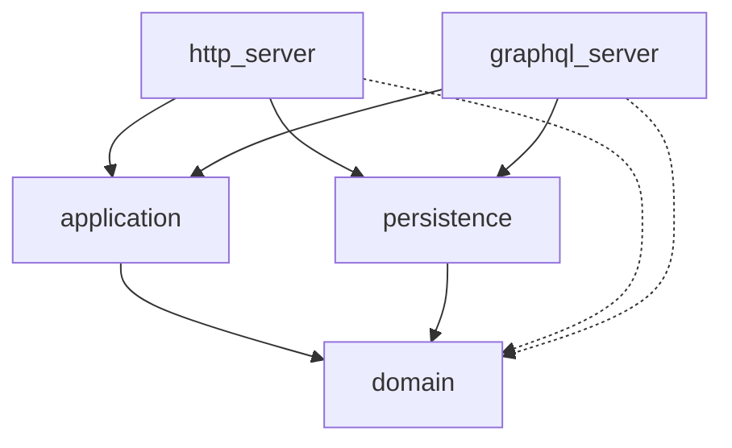

# Project Evaluation — Rust Modular Architecture Demo

## Verdict

**This project succeeds at what it advertises.** It's a clean, well-structured demonstration of hexagonal / ports-and-adapters architecture in Rust, using a library management domain that's complex enough to be interesting without drowning the architectural lesson in business logic.

Evaluated strictly as a *light demo to showcase modular architecture*, here's the breakdown.

---

## What It Proves Well

### 1. Strict Dependency Direction (Inward Only)

The dependency graph is textbook-correct:

- **`domain`** has zero workspace dependencies — only `chrono`, `async-trait`, `anyhow`, `thiserror`. This is the gold standard for a domain crate.
- **`application`** depends only on `domain`. No framework types leak in.
- **`persistence`** implements domain ports, depends on `domain` + `application`, introduces `sqlx` — but only here.
- **`http_server`** / **`graphql_server`** are pure edge crates. They consume application services and wire up deps.

> [!TIP]
> This is the single most important thing the demo needs to show, and it nails it. A reader can look at [domain/Cargo.toml](file:///Users/christophercaldwell/Code/projects/model_architecture/rust/server/crates/domain/Cargo.toml) and immediately see the point.

### 2. Transport-Layer Swappability (The Killer Demo)

Having **two fully wired transport crates** — HTTP (Axum + utoipa/Swagger) and GraphQL (async-graphql) — that share the exact same `application` and `persistence` layers is the strongest proof point in the repo. It's not theoretical; you can `just dev` or `just dev-graphql` and get the same library system through different APIs.

- Both crates have identical [deps.rs](file:///Users/christophercaldwell/Code/projects/model_architecture/rust/server/crates/http_server/src/deps.rs) DI wiring — literally the same `create_server_deps` function.
- Both define their own `ServerDeps` struct with the same shape.
- Both have their own auth middleware, error mapping, and CORS config.

This is exactly the "change how the app is exposed without touching core logic" claim from the README, proven by construction.

### 3. Clean CQRS Separation

Commands and queries are properly separated at the application layer:

| Concern | Commands | Queries |
|---------|----------|---------|
| Catalog | `AddBook`, `AddBookCopy`, `MarkBookCopyLost`, `MarkBookCopyFound`, `SendToMaintenance`, `CompleteMaintenance` | `GetBookCatalog`, `GetBookByIsbn`, `GetBookCopyDetails` |
| Membership | `RegisterMember`, `SuspendMember`, `ReactivateMember` | `GetMemberDetails` |
| Lending | `CheckOutBookCopy`, `ReturnBookCopy`, `ReportLostLoanedBookCopy` | `GetMemberLoans`, `GetOverdueLoans` |

- Commands go through the `WriteUnitOfWorkFactory` → transactional writes.
- Queries use read-only repos with a separate `ro_pool`.
- The read/write pool split in `deps.rs` is a nice touch — it shows the *intent* of CQRS-style read scaling even if it's the same PG instance in practice.

### 4. Domain Modeling

The domain entities have real behavior, not just data bags:

- [Member](file:///Users/christophercaldwell/Code/projects/model_architecture/rust/server/crates/domain/src/member/entity.rs) — `can_borrow()`, `can_be_suspended()`, `can_check_out_more_books()` with loan limit enforcement
- [BookCopy](file:///Users/christophercaldwell/Code/projects/model_architecture/rust/server/crates/domain/src/book_copy/entity.rs) — full state machine (`Active` → `Maintenance` / `Lost`) with guard methods
- [Loan](file:///Users/christophercaldwell/Code/projects/model_architecture/rust/server/crates/domain/src/loan/entity.rs) — `can_be_returned()` check
- Typed IDs (`BookId(i32)`, `MemberId(i32)`, `MemberIdent(String)`) with `#[repr(transparent)]` — shows the newtype pattern clearly

The `CreationPayload → prepare() → Prepared` pipeline is a good demo of separating user input from write-ready data.

### 5. Unit of Work Pattern

The [UnitOfWorkPort](file:///Users/christophercaldwell/Code/projects/model_architecture/rust/server/crates/domain/src/uow.rs) trait and its [SqlUnitOfWork](file:///Users/christophercaldwell/Code/projects/model_architecture/rust/server/crates/persistence/src/uow.rs) implementation show a non-trivial pattern:

- Transaction is shared across repos via `Arc<Mutex<Option<Transaction>>>`
- `commit(self: Box<Self>)` consumes the UoW — one commit per unit of work
- The factory pattern (`WriteUnitOfWorkFactory`) makes DI straightforward

This is one of the harder patterns to implement idiomatically in Rust and it's done well here.

### 6. Error Modeling

Domain errors are `thiserror` enums ([MemberError](file:///Users/christophercaldwell/Code/projects/model_architecture/rust/server/crates/domain/src/member/entity.rs#L67-L77), [BookCopyError](file:///Users/christophercaldwell/Code/projects/model_architecture/rust/server/crates/domain/src/book_copy/entity.rs#L66-L78), [LoanError](file:///Users/christophercaldwell/Code/projects/model_architecture/rust/server/crates/domain/src/loan/entity.rs#L57-L63)) that bubble through `anyhow` in the application layer, then get mapped to HTTP-appropriate responses (409 Conflict for business rule violations, 500 for unexpected errors) in [errors.rs](file:///Users/christophercaldwell/Code/projects/model_architecture/rust/server/crates/http_server/src/router/errors.rs) and to GraphQL error extensions with `code` fields in the [GraphQL mod](file:///Users/christophercaldwell/Code/projects/model_architecture/rust/server/crates/graphql_server/src/router/graphql/mod.rs#L85-L96).

The `conflict_message()` function that walks the `anyhow` error chain and downcasts to domain error types is a practical pattern worth highlighting.

---

## Minor Callouts (All Acceptable for a Demo)

### Things That Are Fine™ but Worth Noting

| Item | Observation | Why It's Fine for a Demo |
|------|-------------|--------------------------|
| **Duplicated `deps.rs` / `dependencies.rs` / `config.rs` / `auth.rs`** | HTTP and GraphQL crates have near-identical files | Proves each transport is independently wired; extracting shared infra would muddy the demo |
| **`BookId(pub i32)` inner field is `pub`** | Breaks encapsulation of the newtype | Avoids boilerplate accessor methods that would distract from the architecture |
| **`contact_inquiry` module in persistence but not in domain** | Persistence has a `contact_inquiry/` dir that domain doesn't | Looks like a leftover or WIP; doesn't affect the architectural story |
| **`book_copy` dir exists in persistence but `domain` also has separate `book` and `book_copy`** | Slightly redundant naming | Correct modeling — a Book and a BookCopy are distinct aggregates |
| **Commented-out `TryFrom<String> for MemberIdent`** in [loan/entity.rs](file:///Users/christophercaldwell/Code/projects/model_architecture/rust/server/crates/domain/src/loan/entity.rs#L19-L27) | Dead code | Reads like a note-to-self; won't confuse a demo reader |
| **`services.rs` is empty** (1 byte) | [ports/services.rs](file:///Users/christophercaldwell/Code/projects/model_architecture/rust/server/crates/application/src/ports/services.rs) | Placeholder for future port definitions |
| **Auth hardcodes audience to `ops.craftcode.solutions`** | Not configurable | Correct for a demo — shows the middleware pattern, not auth best practices |
| **`nanoid` in `application/Cargo.toml` but actually used in transport** | `IdentGeneratorPort` is defined in application, but implemented in `http_server`/`graphql_server` deps.rs | The port is correctly placed; the impl is correctly at the edge |

### One Structural Nit

The `BookPrepared` struct in [book/entity.rs](file:///Users/christophercaldwell/Code/projects/model_architecture/rust/server/crates/domain/src/book/entity.rs#L22-L26) is structurally identical to `BookCreationPayload`, and `prepare()` is a 1:1 field copy. For `Member` and `BookCopy`, `prepare()` actually adds derived state (default status, generated ident), which justifies the two-step pattern. For `Book` it's a no-op — but having the consistent pattern across all entities is arguably *better* for a demo, since it teaches the pattern without the reader needing to figure out when to omit it.

---

## Production Gaps (Correctly Absent)

These are things that would matter for production but are **correctly omitted** for a modular architecture demo:

- No test suite (unit or integration)
- No migrations tooling (raw SQL in `database/sql/`)
- No pagination on list queries
- No request validation / input sanitization layer
- No structured logging beyond `tracing`
- No health check beyond a simple route
- No graceful shutdown
- No rate limiting, metrics, or observability
- No CI/CD config
- `Utc::now()` in [write_repo.rs](file:///Users/christophercaldwell/Code/projects/model_architecture/rust/server/crates/persistence/src/book/write_repo.rs#L43-L44) instead of `RETURNING` timestamps from the DB

None of these detract from the demo's purpose.

---

## Summary

| Criterion | Grade | Notes |
|-----------|-------|-------|
| Dependency direction | ✅ Excellent | Domain → zero deps, Application → domain only, Infra → outward |
| Transport swappability | ✅ Excellent | Two fully working transports prove the claim by construction |
| CQRS separation | ✅ Strong | Read/write pools, separate command/query structs |
| Domain richness | ✅ Good | State machines, guard methods, typed IDs, error enums — enough to be interesting |
| Unit of Work | ✅ Strong | Non-trivial Rust-idiomatic implementation |
| DI / wiring | ✅ Clean | Manual, explicit, no macro magic — easy to follow |
| Code quality | ✅ Good | Idiomatic Rust, clippy pedantic, consistent style |
| Appropriate scope for demo | ✅ Correct | Complex enough to be convincing, simple enough to not be overwhelming |

**Bottom line**: If someone asks "show me hexagonal architecture in Rust," this repo is a solid answer. The two-transport proof is the strongest evidence that the architecture works as advertised.
